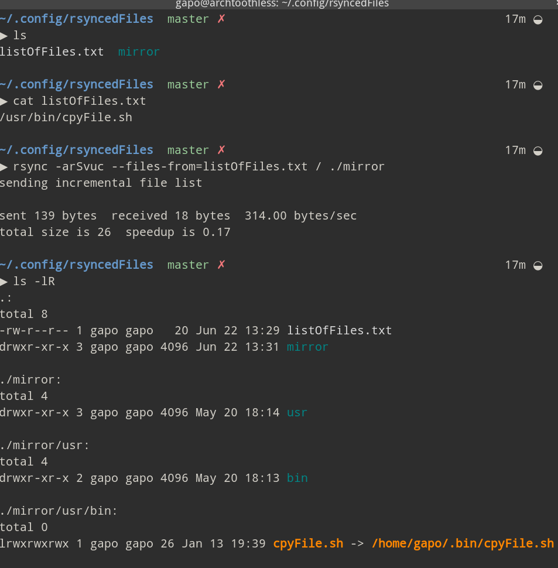

# dotfiles

This is a random hash-tag collection of my various dotfiles.

# Configs

## pqivrc

pqivrc is an image viewer. The config file allows an user to set up pqiv to open an album and then do some pre-configured actions.

The essential objective is that you quickly can create an album from a larger set of pictures in a folder .cache-album without exiting the image viewer.

### Usage

<code> $pqiv /pathToFolder </code>

Now image viewer should open. hit 1 to save into the album

1- runs the script cpyFile.sh into a folder cache-***prefix*** in this case  album

## rsyncedFiles

I ran into this problem where I have files throughout my filesystem that I do not want to move into this directory as it will affect the path. I know I can set the path to this folder but then this spoils my workflow across different shells etc. Considering most of them are trivial scripts, I decided to just rsync them in using a listOfFiles.txt as the index of those file. 

### Usage

cd to the directoy.
If you want to add files - add them to the file listOfFiles.txt.
Run <code>$runRsync.sh</code>
See image 

